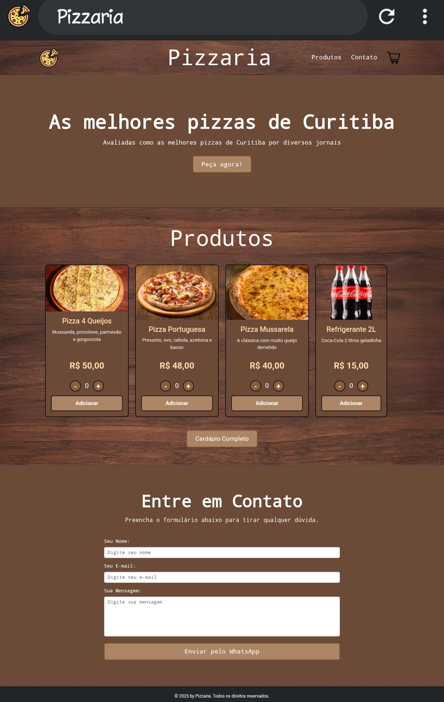
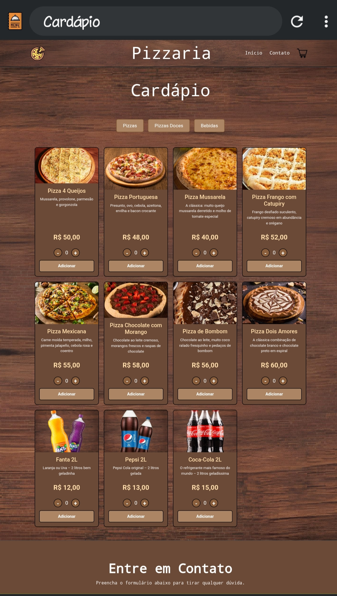

# 🍕 Landing Page – Pizzaria

Projeto desenvolvido durante o curso de Técnico em Desenvolvimento de Sistemas.

## 📌 Descrição
Landing page de uma pizzaria fictícia, com foco na apresentação do negócio, cardápio e informações visuais atrativas.

## 🛠️ Tecnologias utilizadas
- HTML5
- CSS3

## 🎯 Objetivo do projeto
Praticar estruturação de páginas web, organização de layout e estilização com CSS.

## 🔗 Link do site
https://lucasribeiro-silva.github.io/landingPage-Pizzaria/

## 📸 Preview
Pagina Inicial:

Cardápio:

